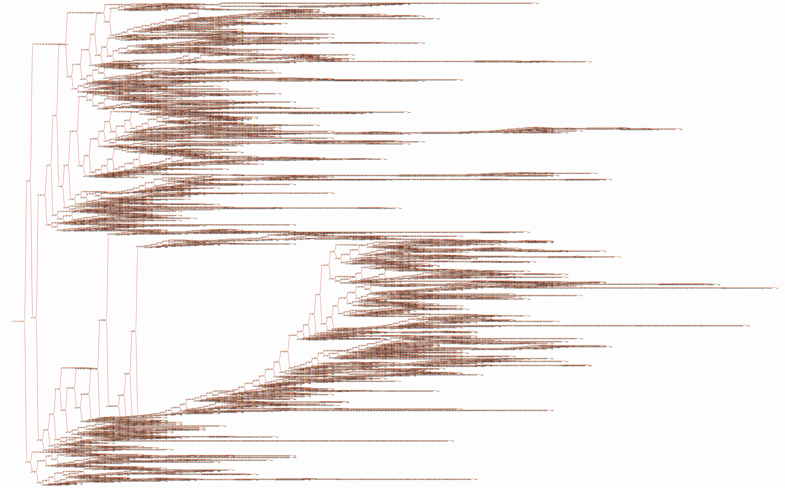

# collatz-with-d3
Basic d3 example showing the number of steps needed for a natural number to reach a stop when calling the collatzConjecture function

Additionally this code creates a tree that allows to create all collatz sequences for the numbers up to 10000. The code can be adapted to generated larger trees. Long branches indicate that that a lot of sequences contain this subsequence. A nice additional feature would be to have the thickness of a branch represent how often this sequence appears.

